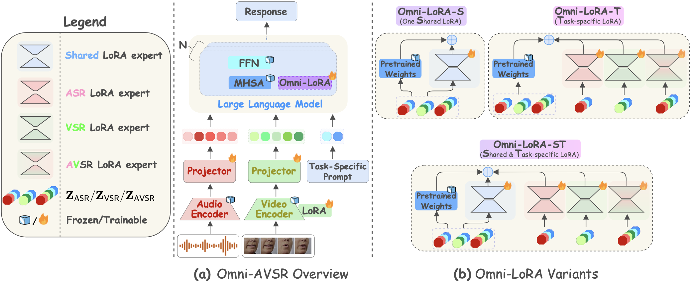
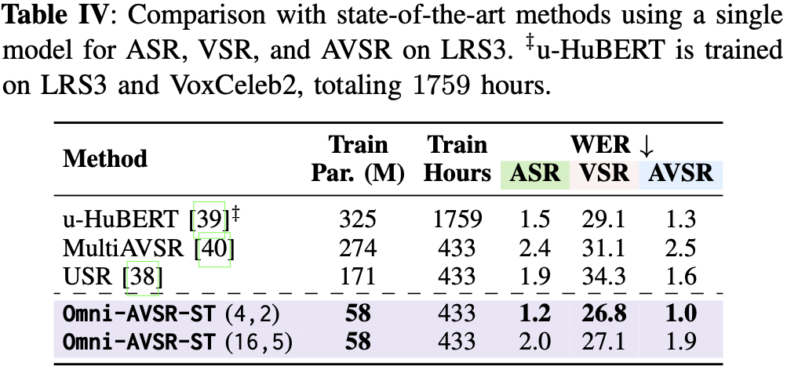
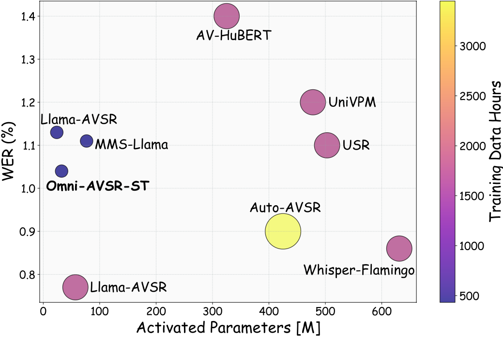
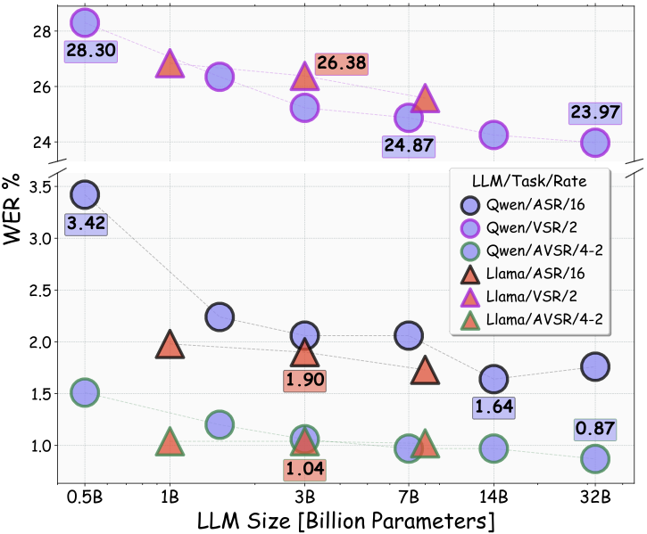

# 🎯 Omni-AVSR: Towards Unified Multimodal Speech Recognition with Large Language Models

<div align="center">

[](https://arxiv.org/abs/your-paper-id)
[](https://umbertocappellazzo.github.io/Omni-AVSR/)
[](https://github.com/umbertocappellazzo/Omni-AVSR)
[](https://github.com/umbertocappellazzo/Omni-AVSR/stargazers)

**[Umberto Cappellazzo¹](#) · [Xubo Liu²](#) · [Pingchuan Ma¹](#) · [Stavros Petridis¹](#) · [Maja Pantic¹](#)**

¹Imperial College London ²University of Surrey

### 📄 [`Paper`](https://arxiv.org/abs/your-paper-id) | 🌐 [`Project Page`](https://github.com/umbertocappellazzo/Omni-AVSR) | 💻 [`Code`](https://github.com/umbertocappellazzo/Omni-AVSR) | 🔖 [`BibTeX`](#-citation)

</div>

---

## 📢 News

- **[2024-11]** 🚀 Code and models released!
- **[2024-10]** 📝 Paper submitted to arXiv.

---

## 🌟 Highlights

<div align="center">
  
  <p><i>Figure 2: Overall architecture of our proposed Omni-AVSR method.</i></p>
</div>

✨ **Key Contributions:**
- We present **Omni-AVSR**, the first audio-visual LLM that supports ASR, VSR, and AVSR jointly while enabling elastic inference under a single set of weights.
- Omni-AVSR hinges upon an optimized *matryoshka*-based 🪆 framework to support efficient multi-granularity training.
- To adapt the backbone LLM to all tasks in a parameter-efficient manner, Omni-AVSR uses three ad-hoc *LoRA*-based methods.
- Omni-AVSR achieves SoTA results on LRS2 and LRS3 benchmarks, whilst substantially reducing training and deployment costs.

---

## 📋 Table of Contents

- [Abstract](#-abstract)
- [Main Results](#-main-results)
- [Installation](#-installation)
- [Quick Start](#-quick-start)
- [Dataset Preparation](#-dataset-preparation)
- [Training](#-training)
- [Evaluation](#-evaluation)
- [Results](#-results)
- [Pretrained Models](#-pretrained-models)
- [Citation](#-citation)
- [Acknowledgements](#-acknowledgements)
- [License](#-license)

---

## 📝 Abstract

> **Omni-AVSR** is a unified multimodal large language model designed to perform auditory (ASR), visual (VSR), and audio-visual (AVSR) speech recognition within a single framework. It integrates **efficient Matryoshka-based multi-granularity training**, enabling flexible control of token compression rates for elastic inference across modalities. To adapt the LLM efficiently, Omni-AVSR introduces **Omni-LoRA**, offering shared, task-specific, and hybrid fine-tuning strategies. Experiments on LRS2 and LRS3 show that Omni-AVSR matches or surpasses state-of-the-art results while drastically reducing training and deployment costs.

---

## 🔬 Main Results

- ⚡ Omni-AVSR attains SoTA results on LRS2 and LRS3 while traning a single model (**Table 1**).
- ⚡ Omni-AVSR outperforms prior SoTA methods that support ASR-VSR-AVSR within a single model (**Table 2**).
- ⚡ Omni-AVSR achieves competitive WERs while requiring substantially fewer parameters and training data hours than all baselines (**Figure 2**).
- ⚡ Among several ablation studies, we report Omni-AVSR trend as we consider LLMs of different sizes from the Llama and Qwen 2.5 families (**Figure 3**). 


<div align="center">
  <table>
    <tr>
      <td align="center" width="50%">
        
        <p><i>Table 1: Main results on LRS2 and LRS3.</i></p>
      </td>
      <td align="center" width="50%">
        
        <p><i>Table 2: Comparison with unified methods on LRS3.</i></p>
      </td>
    </tr>
  </table>
</div>


<div align="center">
  <table>
    <tr>
      <td align="center" width="50%">
        
        <p><i>Figure 4: Comparison with SoTA methods for AVSR on LRS3.</i></p>
      </td>
      <td align="center" width="50%">
        
        <p><i>Figure 5: Scaling trend of Omni-AVSR-ST when we increase the LLM size on LRS3..</i></p>
      </td>
    </tr>
  </table>
</div>

---

## Setup 🛠 
Our setup follows that of [Llama-AVSR](https://github.com/umbertocappellazzo/Llama-AVSR).

### 1) Installation

Install necessary dependencies: 

```bash
   pip install -r requirements.txt
   cd av_hubert
   git submodule init
   git submodule update
   cd fairseq
   pip install --editable ./
```

### 2) Datasets Pre-processing

We rigorously follow auto-avsr [paper](https://arxiv.org/abs/2303.14307) to pre-process the LRS2 and LRS2 datasets. All the steps 
to achieve this can be found [here](https://github.com/mpc001/auto_avsr/tree/main/preparation).

For LRS3, the tree-structure of the directory is:

```text
LRS3  
└─── labels
     ├── lrs3_train_transcript.csv 
     ├── lrs3_test_transcript.csv 
     
└─── lrs3
     ├── lrs3_text_seg16s
     │    └── ...
     └── lrs3_video_seg16s
          └── ...
```

The label files in `[LRS3]/[labels]` and `[LRS2]/[labels]` undergo some processing to make them fit Omni-AVSR. For example, we lowercase the transcription and discard samples whose length is higher than a specific threshold to avoid training instability and peak GPU memory usage. Based on the desired training setting, the processed labels can be accessed below. Once downloaded, they must be moved to `[LRS3]/[labels]` or `[LRS2]/[labels]` subfolders. 

| Label Files | Dataset | Split| Hours |
|-----|:-----:|:-----:|:-----:|
|['lrs3_train_transcript.csv'](https://drive.google.com/file/d/1ahoVBZLl1j_LuAvplEWUdPpd4JpE5O8k/view?usp=drive_link)|LRS3|Train|433|
|['lrs2_train_transcript.csv'](https://drive.google.com/file/d/120YJQmVSdRvNHT-5qq9O0ESrfuPN5WqU/view?usp=drive_link)|LRS2|Train|225|
|['lrs3_test_transcript.csv'](https://drive.google.com/file/d/1DSeKQMUOJKNgE5wcvw91tc_CNsXgSa0l/view?usp=drive_link)|LRS3|Test|/|
|['lrs2_test_transcript.csv'](https://drive.google.com/file/d/1aBQqnTvBIgDxEdnQ0TIrfUuKXrFtF_b4/view?usp=drive_link)|LRS2|Test|/|

---

## 🎓 Training

### Preliminaries 
Before starting the training process, make sure you **1)** have a wandb account to track your experiments and **2)** have access to the pre-trained LLMs like Llama 3.2-1B (i.e., you need to request access from HF [here](https://huggingface.co/meta-llama/Llama-3.2-1B)). You also have to download the AV-HuBERT Large model pretrained on LRS3 + VoxCeleb2, accessible [here](https://dl.fbaipublicfiles.com/avhubert/model/lrs3_vox/clean-pretrain/large_vox_iter5.pt).

To set up the desired experiment to run, we have several main arguments to define, listed below:
<details open>
  <summary><strong>Main Arguments</strong></summary>
    
- `exp-dir`: Directory to save checkpoints and logs to.
- `root-dir`: Root directory of the preprocessed datasets.
- `wandb-project`: Name of the wandb project to track the results.
- `exp-name`: Experiment name. Location of checkpoints is `[exp_dir]`/`[exp_name]`.
- `modality`: The modality we use to train the methods. Choices: [`audio`, `video`, `audiovisual`].
- `llm-model`: The LLM backbone to use (e.g., `meta-llama/Llama-3.2-1B`).
- `compression-mode`: how to compress the audio and/or video tokens. Default: `avg-pooling`.
- `num-nodes`: Number of machines used. Default: `1`.
- `gpus`: Number of GPUs per machine. Default: `1`.

</details>

---

## 📈 Evaluation

### Evaluate on Test Set

```bash
# Evaluate with pretrained model
python evaluate.py \
    --config configs/default.yaml \
    --checkpoint checkpoints/model_best.pth \
    --split test
```

### Metrics

Our evaluation includes:

- **Metric 1**: Description
- **Metric 2**: Description  
- **Metric 3**: Description

---

## 🏆 Results

### Main Results

Performance on [Dataset Name] test set:

| Method | Metric 1 | Metric 2 | Metric 3 | Params (M) |
|--------|----------|----------|----------|------------|
| Baseline A | 75.2 | 0.85 | 2.1s | 25.5 |
| Baseline B | 78.5 | 0.88 | 1.8s | 32.1 |
| **Ours** | **85.3** | **0.92** | **1.5s** | **28.3** |

### Qualitative Results

<div align="center">
  
  <p><i>Figure 3: Qualitative comparison with baseline methods.</i></p>
</div>

### Ablation Studies

| Component | Metric 1 | Metric 2 |
|-----------|----------|----------|
| Baseline | 75.2 | 0.85 |
| + Component A | 80.1 | 0.89 |
| + Component B | 83.5 | 0.91 |
| + Component C (Full) | **85.3** | **0.92** |

---

## 🎁 Pretrained Models

Download our pretrained models:

| Model | Dataset | Performance | Download |
|-------|---------|-------------|----------|
| Model-Base | Dataset1 | 85.3% | [Link](https://drive.google.com/your-link) |
| Model-Large | Dataset1 | 87.1% | [Link](https://drive.google.com/your-link) |
| Model-Base | Dataset2 | 82.5% | [Link](https://drive.google.com/your-link) |

Place downloaded models in `checkpoints/` directory.

---

## 🔖 Citation

If you find our work useful, please cite:

```bibtex
@article{yourname2024yourtitle,
  title={Your Paper Title Here},
  author={Your Name and Co-Author Name},
  journal={arXiv preprint arXiv:2024.12345},
  year={2024}
}
```

---

## 🙏 Acknowledgements

- Our Code relies on [auto-avsr](https://github.com/mpc001/auto_avsr), [avhubert](https://github.com/facebookresearch/av_hubert), and [Llama-AVSR](https://github.com/umbertocappellazzo/Llama-AVSR) repositories
- Built with [PyTorch](https://pytorch.org/)

---

## 📧 Contact

For questions and discussions, please:
- Open an issue on GitHub
- Email: umbertocappellazzo@gmail.com
- Visit our [project page](https://github.com/umbertocappellazzo/Omni-AVSR) and our [preprint]()

---

<div align="center">
